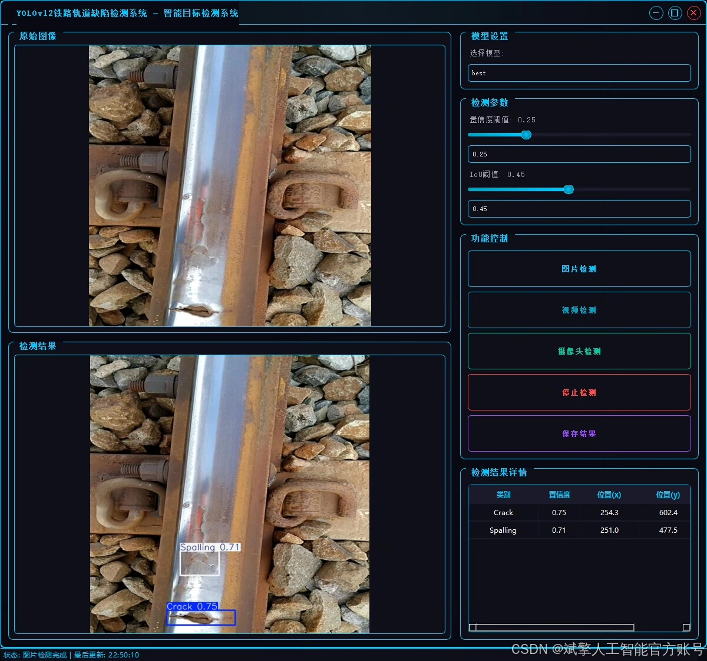
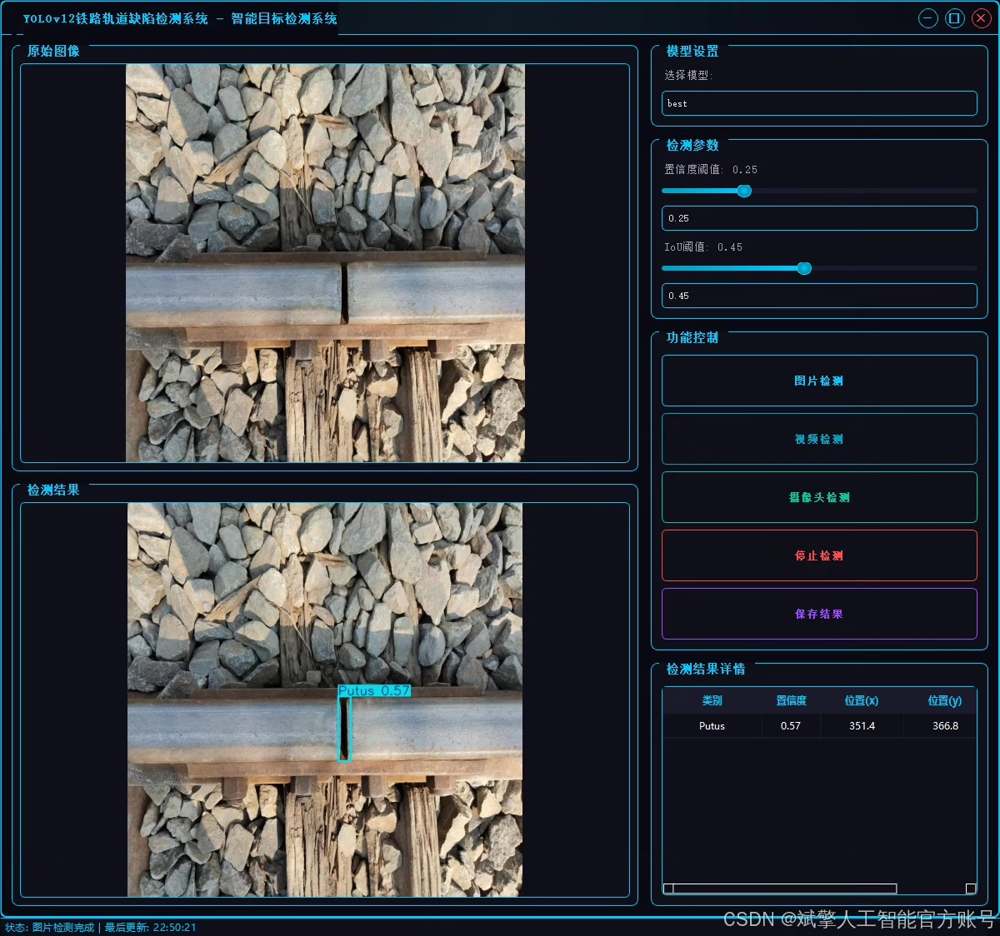
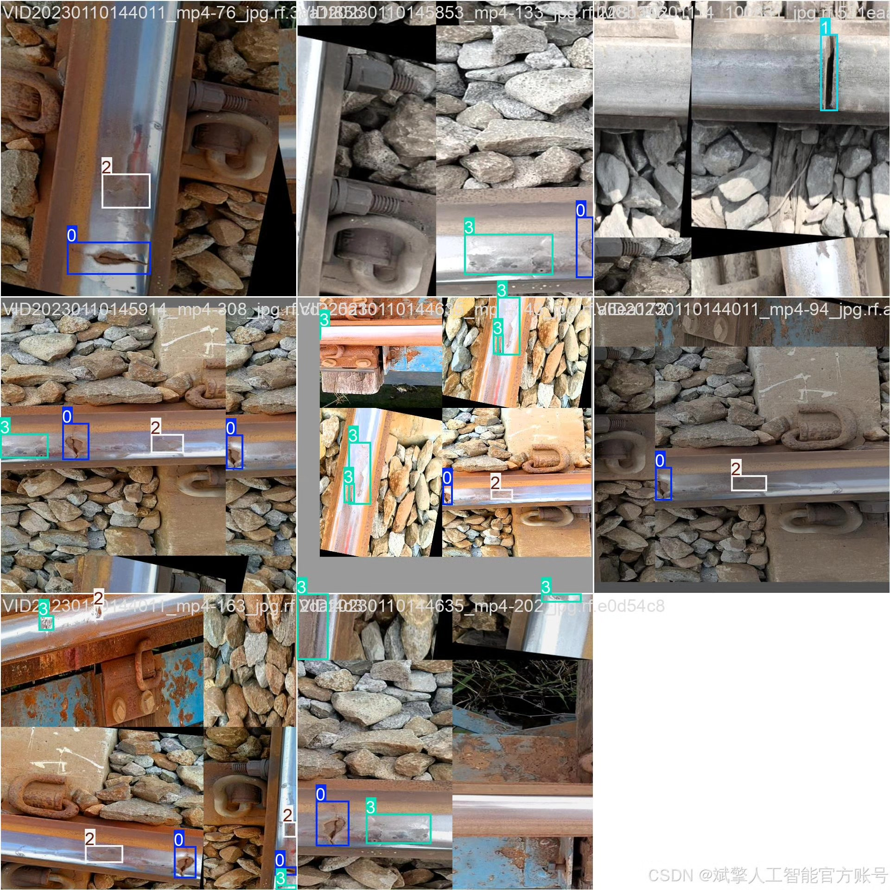
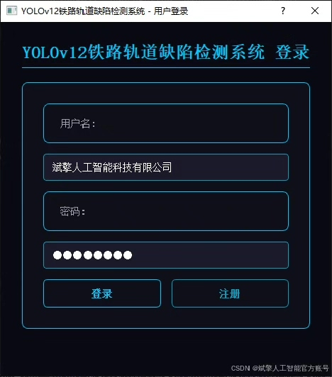
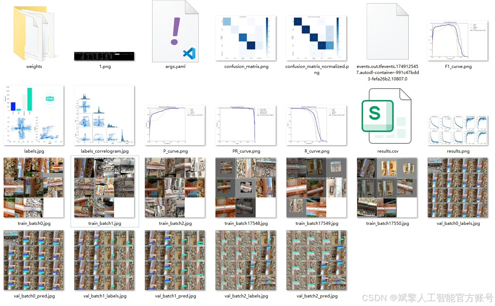
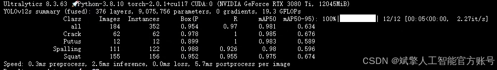
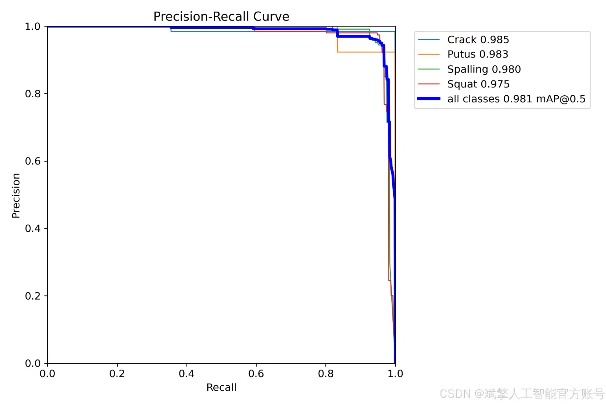
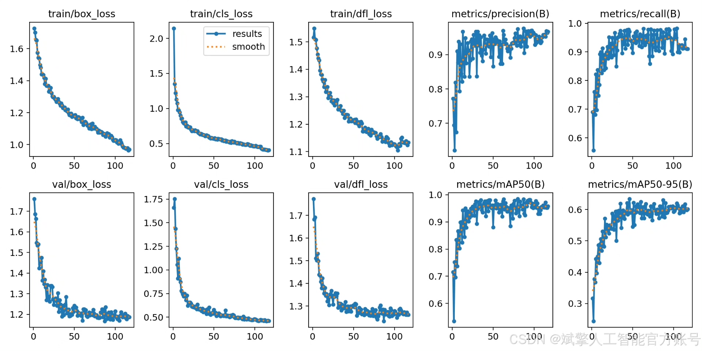
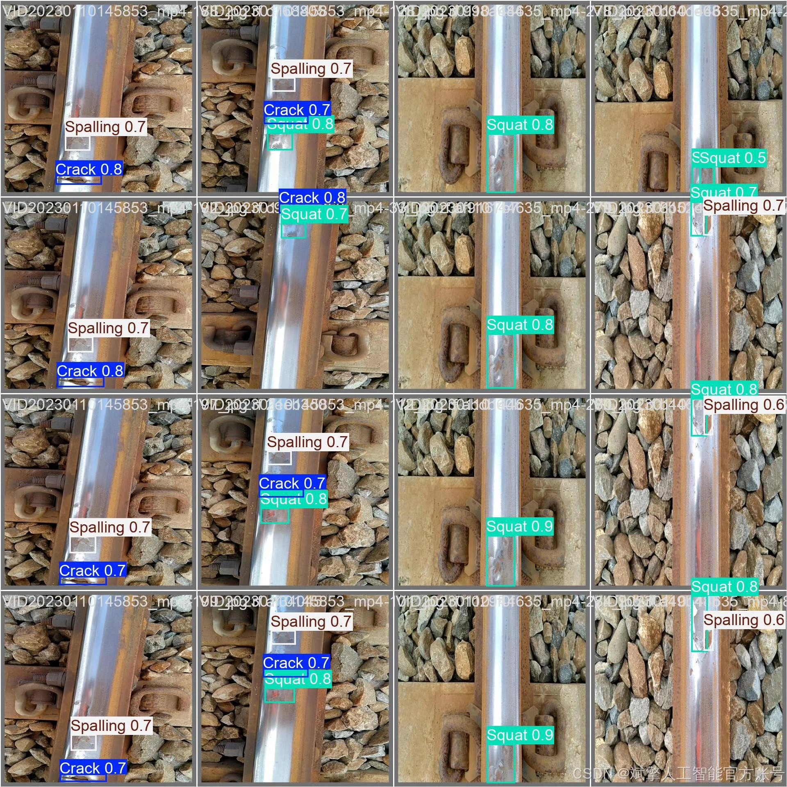

# YOLOv12 Tracking Defect Detection System

## Body

YOLOv12 Track Defect Detection System Based on Deep Learning YOLOv12 for Track Defect Identification and Detection in Railway (YOLOv12+YOLO dataset + UI interface + login registration interface + Python project source code + model)

Track defect detection is an important link to ensure the safety of railway transportation. This paper proposes a smart detection system for track defects based on YOLOv12, which can efficiently identify four common track defects: cracks, breaks, spalling, and buckling. The system uses a dataset containing 1,312 training images, 184 validation images, and 97 test images for model training and evaluation. It also integrates a user-friendly UI interface and login registration functions. Experimental results show that the YOLOv12 model has high accuracy and real-time performance in track defect detection tasks, providing an automated solution for railway maintenance.

✅ User Login Registration: Supports password verification and security authentication.
✅ Three Detection Modes: Based on the YOLOv12 model, supports image, video, and real-time camera detection, accurately identifying targets.
✅ Dual-Screen Comparison: Displays the original scene and detection results on the same screen.
✅ Data Visualization: Real-time table displays the category, confidence, and coordinates of detected targets.
✅ Intelligent Parameter Tuning: Offers a confidence slide bar to dynamically optimize detection accuracy, adapting to different scene requirements.
✅ Sci-Fi Interactive Interface: Dark theme combined with dynamic light effects, reducing visual fatigue and improving operational experience.

## Images

## Payment

Here is a pay link on Stripe ( https://buy.stripe.com/3cs8yP7sY87d0vu9AB ). Please contact me lonlonago@foxmail.com after funding $89, and I will send you a complete data files , thank you!

